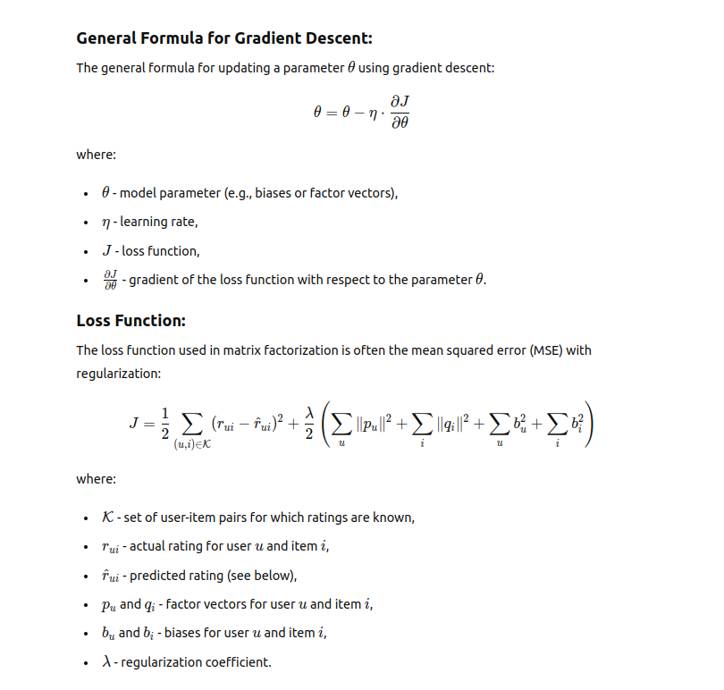
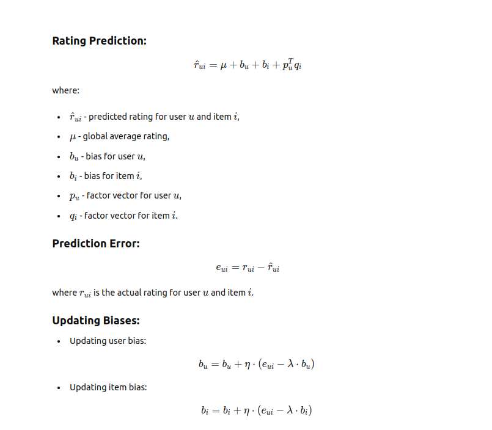
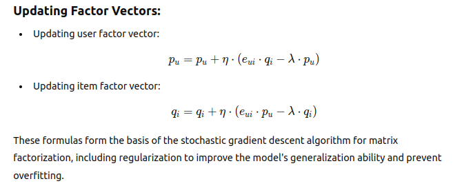

# Recommender System using Matrix Factorization

## Project Outline

 ### Introduction
  - The goal of this project is to create a recommender system using matrix factorization. Matrix factorization is a technique commonly used in     collaborative filtering, where the user-item interaction matrix is decomposed into lower-dimensional matrices representing user and item features.
  - Matrix factorization is a technique used in collaborative filtering-based recommender systems to uncover latent features of users and items from observed user-item interactions. In collaborative filtering, recommendations are generated by analyzing past user behavior and identifying similarities between users or items. In the context of matrix factorization, the goal is to decompose the user-item interaction matrix into two lower-dimensional matrices: one representing users and their preferences (user matrix), and the other representing items and their characteristics (item matrix). By factorizing the original matrix into these latent feature matrices, we can effectively capture underlying patterns and relationships between users and items.Once the user and item matrices are derived, recommendations can be made by predicting missing entries in the original matrix based on the learned latent factors. This allows the recommender system to suggest items to users based on their preferences and similarities to other users or items in the dataset. Overall, matrix factorization enables collaborative filtering-based recommender systems to provide personalized recommendations by leveraging the discovered latent features of users and items from historical interaction data.

 ### Dataset
  - The dataset used in this project is sourced from MovieLens, a popular platform for movie recommendations. It comprises information on users, movies, and their corresponding ratings. Specifically, the dataset contains user interactions with movies, where each interaction consists of a user rating for a particular movie. This data allows us to analyze user preferences and movie characteristics, facilitating the creation of a recommendation system. .
  

### Data Preprocessing
  
1. **Loading the Dataset:**
    ```python
    data = pd.read_csv('./ratings_filtered.csv', nrows=10000)

    ```
2. **Creating the User-Item Matrix: The dataset is then transformed into a user-item matrix using the csr_matrix function from the SciPy library. This matrix represents users, movies, and their corresponding ratings:**
    ```python
    ratings = csr_matrix(
    (data.rating.values, (data.userId.values, data.movieId.values)),
    shape=(data.userId.max() + 1, data.movieId.max() + 1)).toarray()
    ```
 
### Matrix Factorization
 - When the initialize() method is called, all model parameters are initialized, including user and item biases as well as user and item feature vectors. User and item feature vectors are initialized randomly from a normal distribution, with their dimensionality determined by the n_factors parameter, which represents the number of latent factors used to represent users and items. After the model is initialized, it is trained using gradient descent (GD), during which model parameters are updated to minimize the loss function. User and item feature vectors are gradually adjusted during training to make the model's predictions closely match the actual ratings in the training dataset.
```python
    self.user_vecs = np.random.normal(scale=1 / self.n_factors, size=(self.n_users, self.n_factors))
    self.item_vecs = np.random.normal(scale=1 / self.n_factors, size=(self.n_items, self.n_factors))
```
### Training the Model
 - The fit() method in the provided code is responsible for training the Matrix Factorization model using Stochastic Gradient Descent (SGD). Here's a breakdown of how the fit() method trains the model:
1. **Epoch Iteration:**
   - The training process is divided into epochs, where each epoch represents a complete pass through the training data. The number of epochs is determined by the n_iter parameter. The training loop starts from epoch 1 and continues until the specified number of epochs is reached.
2. **Shuffling Data:**
    - At the beginning of each epoch, the indices of non-zero elements in the user-item matrix are shuffled. This randomizes the order in which the model processes the training data, helping to prevent the model from getting stuck in local minima during optimization.
3. **Gradient Descent Updates:**
    -  Within each epoch, the model iterates over the shuffled indices of non-zero elements. For each non-zero rating, the model predicts the rating using the predict() method. Then, the prediction error is computed by subtracting the predicted rating from the actual rating.
4. **Parameter Updates**
    - The prediction error is used to update the model parameters, including user biases, item biases, user vectors, and item vectors. The update_biases_and_vectors() method adjusts these parameters using gradient descent with regularization. The learning rate (l_rate) controls the size of the parameter updates, while the regularization parameter (alpha) helps prevent overfitting by penalizing large parameter values.
5. **Evaluation**
    - After completing each epoch, the model evaluates its performance by calculating the mean squared error (MSE) between the predicted ratings and the actual ratings in the training dataset. The evaluate_the_model() method computes the MSE and stores it for later analysis.
5. **Early Stopping:**
    - During training, the early_stopping() method monitors changes in MSE between consecutive epochs. If the change in MSE falls below a specified tolerance (tol) for a certain number of consecutive epochs (n_iter_no_change), the training process stops early to prevent overfitting.
- Once the specified number of epochs is reached or early stopping criteria are met, the training process is completed. The trained model can then be used to make predictions and generate recommendations for users based on their preferences.

### Making Predictions and the `predict()` Function
1. **Prediction Formula**: The method computes the predicted rating for a given user-item pair (u, i) using the following formula:

- `global_bias`: The global average rating in the dataset.
- `user_bias[u]`: The bias associated with user `u`, representing the user's tendency to rate items higher or lower than the global average.
- `item_bias[i]`: The bias associated with item `i`, representing the item's overall popularity or quality.
- `user_vector[u]`: The latent feature vector associated with user `u`, capturing the user's preferences across different latent features.
- `item_vector[i]`: The latent feature vector associated with item `i`, capturing the item's characteristics across different latent features.
- `@`: Denotes the dot product between the user vector and item vector.

2. **Components of Prediction**:
- The global bias, user bias, and item bias provide the baseline rating prediction.
- The dot product between the user vector and item vector captures the interaction between the user's preferences and the item's characteristics.

3. **Incorporating Predictions**: Once the prediction is computed, it can be used to provide recommendations to users. In the provided code, predictions above a certain threshold (e.g., 4.5) are considered positive recommendations.

4. **Usage**: The `predict()` method is called during both the training phase and the prediction phase. During training, it is used to compute predictions for non-zero entries in the training dataset. During prediction, it can be used to generate recommendations for users based on their preferences and the learned latent features of items.

Overall, the `predict()` method plays a crucial role in estimating user-item ratings and providing personalized recommendations within the Matrix Factorization model.


### Visualization and the `plot_the_score()` Function

In the provided code, the `plot_the_score()` function is responsible for visualizing the training progress by plotting the mean squared error (MSE) loss over epochs. Here's an overview of how it works:

1. **Plotting the Training Progress**:
   - The function generates a line plot where the x-axis represents the number of epochs, and the y-axis represents the mean squared error (MSE) loss.
   - Each point on the plot corresponds to the MSE loss value at a specific epoch during the training process.

2. **Interpreting the Plot**:
   - The plot provides insights into how the MSE loss changes over epochs, indicating the convergence or divergence of the training process.
   - A decreasing trend in the MSE loss suggests that the model is learning to make better predictions over time.
   - Fluctuations or plateaus in the plot may indicate issues such as overfitting, underfitting, or convergence problems.

3. **Usage**:
   - The `plot_the_score()` function is typically called after training the Matrix Factorization model using the `fit()` method.
   - By visualizing the training progress, users can assess the performance of the model, identify potential issues, and make informed decisions about model tuning and optimization.

4. **Interpretation Tips**:
   - If the MSE loss decreases consistently over epochs and stabilizes at a low value, it indicates successful convergence and good model performance.
   - Rapid fluctuations or a lack of significant improvement may suggest that the model requires further adjustments, such as fine-tuning hyperparameters or increasing training data.

Overall, the `plot_the_score()` function facilitates the visual analysis of the training process, enabling users to monitor the performance of the Matrix Factorization model and make informed decisions to improve its effectiveness.

## Math formulas






